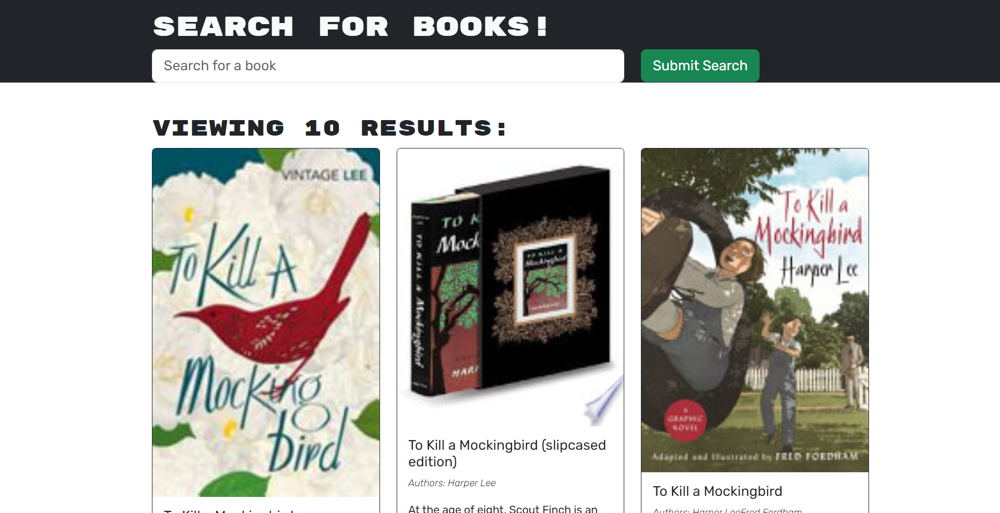

# Book-search
  
  ## Description
  This is a full stack MERN(Mongo. Express. REACT.Node) app that was refactored from using restful API to use Graph QL queries. This app is a book search and save app. Users can keep track of their searched books and all its info for foture reference.

  Deployed link: https://dcbooksearch-d715f1f176bd.herokuapp.com/
  
  
  
  
___
  ## Table of Contents
  * [Installation](#installation)
  * [Usage](#usage)
  * [Licenses](#licenses)
  * [Contribute](#contribute)
  * [Tests](#tests)
  ___
  ## Installation
  For this app make sure to clone or copy the files from the repo to your local machine. From there you can run npm run develop after installing all you dependencies of course. Or you can simply use the deployed link and then install.
  ___
  ## Usage
  To use the app just start by making an account. Then you are free to use the save and search features to navigate the app. 
  ___
  ## Licenses
  
      This Project is utilizing the GPLv3 license. To learn more click the lisence to view.
  ___
  ## Contribute
  In order to contribute, you can add any features or fixes to improve the app. If you have a feature that you want to add and share feel free to leave a commant on the repo to colaborate.
  ## Tests
  In order to test, feel free to test the app for any werid issuse and/or bugs due to typos or inefficient code. Then open an issue on the repo to colaborate.
  ___
  ## Have Questions? Contact Me!
  
  Visit my GitHub: DiegoCamilli
  Contact me via Email at: camillidiego011@gmail.com